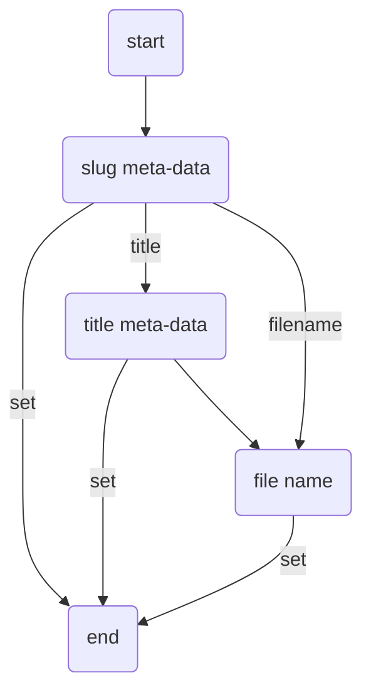

# Setting up the meta plugin

## Introduction

As you can see on the left - side menu, this plugin is placed as the first one. It is because this plugin can be considered as one that influences the way, you will be writing a documentation. So, why it's so essential?

There are a few reasons:

1. Automatic navigation building based on file and directory names. This simplifies a process of a document navigation creation in `mkdocs.yml` file, described in [official documentation](https://www.mkdocs.org/user-guide/writing-your-docs/#configure-pages-and-navigation).
2. Based on file meta-data, you can set document:
	- [URL](#Navigation%20automatic%20generation),
	- [creation/update date](#Dates),
	- [document publication state](#Document%20publication%20status),
	- and some other less important.
	Most of these options, influence the SEO of the page build using MkDocs.

Probably you are now wondering why 2 quite different functionalities are placed in one plugin?

The answer is not so obvious and a bit technical, but in bigger simplification, it's way simpler and less complex to bound those functionalities together. The main reason for that is how MkDocs internals work. For example, when navigation is built and when final HTML files are generated. Other example could be a document status implementation that influences navigation building, file list creation and `sitemap.xml` creation. This process should be considered as one functionality and splitting it over 2 separate plugins is possible, but it will not only increase code complexity, but also will increase significantly complexity of configuration since many settings used for automatic navigation building are the same for defining file meta-data. So, if we split functionality into 2 separate plugins, the final user (You) will have to maintain consistency in `mkdocs.yml` file. With a single plugin approach, we can reduce this problem to just maintaining a single point of configuration and settings validation.

> [!warning] Important
> However, this plugin is not needed for other plugins to work correctly, it's highly recommended to use it.

## Meta-data

Markdown documents can contain additional metadata that is not rendered by MkDocs. This metadata is located at the beginning of the file (more information about this you can found in MkDocs documentation in [Meta-Data section](https://www.mkdocs.org/user-guide/writing-your-docs/#meta-data)).

MkDocs supports 2 main formats of meta-data:

===+ ":octicons-markdown-16: YAML_style.md"

	It's preferred style since more plugins supports it and its the same format as in `mkdocs.yml` file. Also this format is supported by other tools (like [Jekyll](https://jekyllrb.com/docs/front-matter/) that is used in GitHub or [GitLab](https://docs.gitlab.com/ee/user/markdown.html#front-matter))

	```markdown
	---
	title: Your document title
	description: A short description of document content that encourage to read it
	---

	This is the first paragraph of the document.
	```

=== ":octicons-markdown-16: MultiMarkdown_syle.md"

	This style is NOT prefered since not all plugins and other tools supports it.

	```markdown
	Title: Your document title
	Description: A short description of document content that encourage to read it

	This is the first paragraph of the document.
	```

> [!info] YAML front matter
> Since the YAML front matter format for meta-data is used by a wider set of other plugins and tools, this format will be used in this tool documentation.

### Document meta-data

As described in the previous section, you can provide additional meta-data that is unique for that document, and can change some behavior of the meta plugin, but not only. Some other MkDocs plugins also utilize these types of settings. One of the plugins is [pub-blog](02_setting-up-blog.md)or plugins included in [Material for MkDocs](https://squidfunk.github.io/mkdocs-material/).

### Directory meta-data

The same approach can be taken for setting this up in the case of directories. To provide meta-data values, you have to create a file `README.md` inside the given directory and put the values accepted by this plugin. A list of possible settings can be found below.

## Dates

In the metadata, there is a possibility to add two values related to dates.

=== ":octicons-markdown-16: date"

	This defines a value for the document's creation date. It's also used by [a blog plugin](02_setting-up-blog.md) for blog posts ordering and a meta plugin for updating a sitemap file.

	```yaml hl_lines="2"
	---
	date: 2023-05-19 15:40:36
	---
	```

=== ":octicons-markdown-16: update"

	This defines a value for the document's last update date. It's also used by a meta plugin for updating a sitemap file.

	```yaml hl_lines="2"
	---
	update: 2023-06-12 14:16:52
	---
	```

> [!Info] Date format
> Currently, the date format is hard-coded and cannot be changed, and is defined according to [Python date format codes](https://docs.python.org/3/library/datetime.html#strftime-and-strptime-format-codes) and looks like this: `%Y-%m-%d %H:%M:%S` (example: `2023-06-12 14:16:52`).


## Navigation automatic generation

> [!warning] Warning
> If the meta plugin is enabled, document navigation is automatically created by the plugin. So if you have your navigation already created, you will have to set up the navigation in the way, how meta plugin is building it. Currently, this is the only way to provide functionality like single document or directories status.

In short, navigation automatic generation works based on alphabetical order of files and directories. If you are using any IDE (like [PyCharm](https://www.jetbrains.com/pycharm/), [VsCode](https://code.visualstudio.com) or [Obsidian](https://obsidian.md)) for documents creation and editing, the way of file order you see by default in the project or file browser of the tool, is the order of the files in navigation. Probably the easiest way of file ordering is to provide some prefix with the digits (take a look at [this documentation repository](https://github.com/mkusz/mkdocs-publisher/tree/main/mkdocs_publisher_docs) for better understanding). The main problem with this approach would be strange names in file URLs and documentation titles on the web page. To solve that problems, the meta plugin uses two meta-data values that are common for document files and directories:

===+ ":octicons-markdown-16: title"

	`title` is responsible for document name that is visible in the generated web page.

	```yaml hl_lines="2"
	---
	title: Document title
	---
	```

=== ":octicons-markdown-16: slug"

	`slug` is responsible for document URL. For more information, take a look [here](#Slug).

	```yaml hl_lines="2"
	---
	slug: document-slug
	---
	```

### Document publication status

One of the functions provided by the meta plugin is a possibility to set document publication status. Each publication status has some implications for navigation building and links creation.

===+ ":octicons-markdown-16: published.md"

	```yaml hl_lines="2"
	---
	publish: true3
	---
	```

	When the document publication status is set to `true` (or `published`), the document will appear in navigation and link to it, will be visible on the generated web page.

=== ":octicons-markdown-16: hidden.md "

	```yaml hl_lines="2"
	---
	publish: hidden
	---
	```

	When the document publication status is set to `hidden`, the document will not appear in navigation, but will be generated, and it's possible to create a link to this document or enter a direct URL address.

=== ":octicons-markdown-16: draft.md"

	```yaml hl_lines="2"
	---
	publish: false
	---
	```

	When the document publication status is set to `false` (or `draft`), the document will not appear in navigation and will not be generated. However, when using local document hosting by issuing the command `mkdocs serve`, each draft document will be generated to help with document creation and visual inspection.

> [!NOTE] Default document status
> If publication status is not set for document, by default status is set to `false`, so the document will not be published accidentally.

### Directory publication status

Publication status can also be set for whole directories. This gives you a control over the whole set of documents that are placed in given directories. Each publication status has some implications for navigation building and links creation.

===+ ":octicons-markdown-16: README.md for published directory"

	```yaml hl_lines="2"
	---
	publish: true
	---
	```

	When the publication status is set to `true` (or `published`) in `README.md` file, the directory will appear in navigation and link to it and documents in this directory, will be visible on the generated web page.

=== ":octicons-markdown-16: README.md for hidden directory"

	```yaml hl_lines="2"
	---
	publish: hidden
	---
	```

	When the publication status is set to `hidden` in `README.md` file, the directory will not appear in navigation, but documents in this directory will be generated and could be accessible by internal linking or by passing direct URL address in the web browser.

=== ":octicons-markdown-16: README.md for draft directory"

	```yaml hl_lines="2"
	---
	publish: false
	---
	```

	When the publication status is set to `false` (or `draft`) in `README.md` file, the directory will not appear in navigation and documents in this directory will not be generated. However, when using local document hosting by issuing the command `mkdocs serve`, each directory and documents will be generated to help with document creation and visual inspection.

> [!NOTE] Default directory status
> If publication status is not set for directory, by default status is set to `true`, so there is no need to create `README.md` file in each directory.

### Slug

While documentation is generated, each of the file is converted from Markdown into HTML format. MkDocs preserves directories and file names, so the URL structure is the same as the Markdown structure. Quite often, this is not the best option for SEO and you may want to change it. To achieve it, you have to provide a `slug` meta-data value. You can provide it for both: files and directories.

Let's consider the below directory structure:

```console hl_lines="2-4"
.
└─ docs/
       └─ 99_other/
              └─ 08_faq.md
```

This will produce this kind of URL:

> https://yourdomain.com/99_other/08_faq/

It doesn't look good and is difficult to remember and not good in SEO perspective. To improve it, the above URL should look like this:

> https://yourdomain.com/other/faq/

To make it happen, you have to use:

- `README.md` inside `99_other` directory to change its URL to `other`,
- `08_faq.md` to change its URL to `faq`.

=== ":fontawesome-solid-folder-tree:"

    You have to add `README.md` file inside `99_other` directory, so the file structure will looks like this.

    ```console hl_lines="4"
	.
	└─ docs/
	       └─ 99_other/
			      ├─ README.md
	              └─ 08_faq.md
    ```

=== ":octicons-markdown-16: README.md"

	```yaml hl_lines="2"
	---
	slug: other
	---
	```

=== ":octicons-markdown-16: 08_faq.md"

	```yaml hl_lines="2"
	---
	slug: faq
	---
	```

#### Generation mode

Slug can be generated based on one of the values:

- `slug` meta-data value,
- `title` meta-data value,
- directory or file name.

There are 3 slug generation modes that combine the above methods:

- `title`  (default)
- `filename`

Below, you can see, a simplified algorithm of how slug is obtained.



> [!TIP] Using `slug` meta-data
> Despite the possibility to generate slug by using other methods, `slug` meta-data always overrides any other value.

> [!NOTE] Default slug generation mode
> Slug generation mode is by default set to `title`.

> [!NOTE] Fallback mechanism
> In case of any problem with obtaining slug value, there is also a fallback mechanism, that will use directory/file name.

> [!NOTE] MkDocs backward compatibility
> When slug generation method is set to `filename` or fallback mechanism is triggered, slug is generated the same way as MkDocs default configuration.

## Configuration

To enable the built-in meta plugin, the following lines have to be added to `mkdocs.yml` file:

===+ ":octicons-file-code-16: mkdocs.yml"

    ```yaml hl_lines="2"
    plugins:
      - pub-meta
    ```

### General

===+ ":octicons-file-code-16: mkdocs.yml"

	```yaml hl_lines="3"
	plugins:
	  - pub-meta:
		  dir_meta_file: README.md
	```

Above you can find all possible settings with their default values. You don't have to provide them. Just use them if you want to change some settings. The description of the meaning of given setting, you can find below.

> [!SETTINGS]- [dir_meta_file](#+meta.dir_meta_file){#+meta.dir_meta_file}
> File name containing metadata for directories. The default file name is `README.md` because this file name is used by [GitHub](https://docs.github.com/articles/about-readmes) and [GitLab](https://docs.github.com/en/repositories/managing-your-repositorys-settings-and-features/customizing-your-repository/about-readmes) (the two most popular git repositories providers) as an index files for the directory. By using this name, this file ideally blends into git repository when the whole documentation is stored in one.

### Slug

===+ ":octicons-file-code-16: mkdocs.yml"

	```yaml hl_lines="3-7"
	plugins:
	  - pub-meta:
		  slug:
			enable: true
			mode: title
			warn_on_missing: true
			key_name: slug
	```

Above you can find all possible settings with their default values. You don't have to provide them. Just use them if you want to change some settings. The description of the meaning of given setting, you can find below.

> [!SETTINGS]- [enabled](#+meta.slug.enabled){#+meta.slug.enabled}
> Control if slug metadata will be used while document URL is created while generating a web page.

> [!SETTINGS]- [mode](#+meta.slug.mode){#+meta.slug.mode}
> Defines how document slug will be generated.

> [!SETTINGS]- [warn_on_missing](#+meta.slug.warn_on_missing){#+meta.slug.warn_on_missing}
> MkDocs contains a switch for [strict mode](https://www.mkdocs.org/user-guide/configuration/#strict). This mode forces break of document generation on any warning and if this option is also enabled, it will force check of all documents, containing a `slug` key defined.

> [!SETTINGS]- [key_name](#+meta.slug.key_name){#+meta.slug.key_name}
> Metadata key name for slug value.

### Publication status

===+ ":octicons-file-code-16: mkdocs.yml"

	```yaml hl_lines="3-10"
	plugins:
	  - pub-meta:
		  publish:
			search_in_hidden: false
			search_in_draft: false
			file_default: draft
			file_warn_on_missing: true
			dir_default: published
			dir_warn_on_missing: false
			key_name: publish
	```

Above you can find all possible settings with their default values. You don't have to provide them. Just use them if you want to change some settings. The description of the meaning of given setting, you can find below.

> [!SETTINGS]- [search_in_hidden](#+meta.status.search_in_hidden){#+meta.status.search_in_hidden}
> When [Material for MkDocs search](https://squidfunk.github.io/mkdocs-material/setup/setting-up-site-search/#version-strings) plugin is enabled, by default, all documents are indexed and searchable (even those that are hidden by this plugin). To exclude hidden files from being searchable, normally you would have to [place an additional value](https://squidfunk.github.io/mkdocs-material/setup/setting-up-site-search/#search-exclusion) in each hidden document. To make things easier for you, the meta plugin handles it for you, and all hidden documents, are excluded from search. You can change this behavior by changing this value.

> [!SETTINGS]- [search_in_draft](#+meta.status.search_in_draft){#+meta.status.search_in_draft}
> When [Material for MkDocs search](https://squidfunk.github.io/mkdocs-material/setup/setting-up-site-search/#version-strings) plugin is enabled, by default, all documents are indexed and searchable (even those that are draft by this plugin). To exclude draft files from being searchable, normally you would have to [place an additional value](https://squidfunk.github.io/mkdocs-material/setup/setting-up-site-search/#search-exclusion) in each draft document. To make things easier for you, the meta plugin handles it for you, and all draft documents, are excluded from search. You can change this behavior by changing this value.

> [!SETTINGS]- [file_default](#+meta.status.file_default){#+meta.status.file_default}
> Defines default status of publication for documents. More information about this, you can find on this page in the section [document publication status](#Document%20publication%20status).

> [!SETTINGS]- [file_warn_on_missing](#+meta.status.file_warn_on_missing){#+meta.status.file_warn_on_missing}
> MkDocs contains a switch for [strict mode](https://www.mkdocs.org/user-guide/configuration/#strict). This mode forces break of document generation on any warning and if this option is also enabled, it will force checking all documents, containing a `status` key defined.

> [!SETTINGS]- [dir_default](#+meta.status.dir_default){#+meta.status.dir_default}
> Defines default status of publication for directories. More information about this, you can find on this page in the section [directory publication status](#Directory%20publication%20status).

> [!SETTINGS]- [dir_warn_on_missing](#+meta.status.dir_warn_on_missing){#+meta.status.dir_warn_on_missing}
> MkDocs contains a switch for [strict mode](https://www.mkdocs.org/user-guide/configuration/#strict). This mode forces break of document generation on any warning and if this option is also enabled, and it will force checking all directories (in fact `README.md` file in directory), containing a `status` key defined.

> [!SETTINGS]- [key_name](#+meta.status.key_name){#+meta.status.key_name}
> Metadata key name for status value.

### Title

===+ ":octicons-file-code-16: mkdocs.yml"

	```yaml hl_lines="3-4"
	plugins:
	  - pub-meta:
		  title:
			key_name: title
	```

Above you can find all possible settings with their default values. You don't have to provide them. Just use them if you want to change some settings. The description of the meaning of given setting, you can find below.

> [!SETTINGS]- [key_name](#+meta.title.key_name){#+meta.title.key_name}
> Metadata key name for title value.
