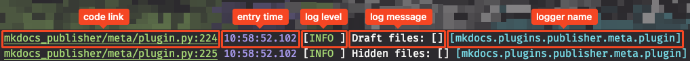

# Setting up a debugger plugin

## Introduction

Each good developer knows, how important is the possibility to read proper logs from running application when there is some issue. MkDocs by default produces some logs while documentation is being built or while the built-in server is running. Because the whole MkDocs is written using the Python programming language, there is a possibility to configure a debugger in tools like PyCharm or VsCode. But how to handle logging when you are just a user and do not have a needed knowledge and just want to submit an issue because you have found some problem? To help with debugging by logging and producing additional files that can be attached to the issue submission, Publisher for MkDocs contains a `pub-debugger` plugin. It's built with 3 main modules:

- [console logger](#Logging%20to%20the%20console) that allows to change the output produced to the console,
- [file logger](#Logging%20to%20the%20file) that allows to produce the log file,
- [Zip file generator](#Generating%20Zip%20file) that allows to produce a Zip file with log file produced by previous module and some additional files like `mkdocs.yml` and Python package files like `requirements.txt` or `pyproject.tml` and `poetry.lock` (depends on type of Python package manager you have used).

> [!INFO] Console and file logger settings
> Both console and file loggers are configured separately and their defaults settings are different.

> [!WARNING] Privacy disclaimer
> `pub-debugger` plugin do not send any files over the internet, but if you want to use a Zip file as an attachment for an issue submission or share it with anybody, before please make a review of the content of this archive file.
> > [!DANGER] Please remember
> > It's your data and your responsibility what you are publishing over the internet. This plugin is only giving you the tool that should help, and you cannot blame me (the author of this plugin) for any potential data leaks.

## Python logging for MkDocs

> [!INFO] Information
> This section is for any MkDocs plugin developer.

Because MkDocs is written in Python, whenever someone wants to write a new plugin and see some information during documentation build, he has to use a [logging library](https://docs.python.org/3/library/logging.html). The usual use of this library is to do something like this:

===+ ":octicons-file-code-16: new_mkdocs_plugin.py"

```python hl_lines="3-4"
import logging

logger = logging.get_logger(__name__)
logger.info("Some output")
```

The biggest problem with this approach is that `__name__` becomes a file name (without extension), so the logger for the above example is `new_mkdocs_plugin`. Since all loggers inside MkDocs have a name corresponding to a directory structure that leads to the file where logger is used, any MkDocs plugin developer should do the same.


> [!TIP] The best practice for logger naming
> Logger name should be built according to given structure:
> `mkdocs.plugins.[project_name].[directory].[optional_sub_directories].[file_name]`.

Let's take a look at [one of the files from this project repository](https://github.com/mkusz/mkdocs-publisher/blob/main/mkdocs_publisher/minifier/minifiers.py).

===+ ":octicons-file-code-16: minifier.py"

	```python hl_lines="5"
	import logging

	...

	log = logging.getLogger("mkdocs.plugins.publisher.minifier.minifiers")
	```

=== ":fontawesome-solid-folder-tree:"

	```console hl_lines="1-4"
	.
	└─ mkdocs_publisher/
	  └─ minifier/
		└─ minifiers.py
	```


##  Configuration

To enable the built-in debugger plugin, the following lines have to be added to `mkdocs.yml` file:

===+ ":octicons-file-code-16: mkdocs.yml"

    ```yaml hl_lines="2"
    plugins:
      - pub-debugger
    ```

### Console logging

By default, MkDocs produces a console log, that contains only basic information like log level and log message. In normal usage, this information is quite sufficient, but when any problem with a build process occurs, it's quite hard to find a specific line where the problem has happened. Because of that, `pub-debugger` allows you to override the default console logger with one that contains more information. Below you can find what does it look like:



> [!INFO] Code link
> Be aware, that the above screenshot is the most future rich output. The default plugin configuration doesn't enable the **code link** section (it has to be enabled).

===+ ":octicons-file-code-16: mkdocs.yml"

``` yaml hl_lines="3-10"
plugins:
  - pub-debugger:
	console_log:
	  enabled: true
	  log_level: INFO
	  show_code_link: false
	  show_logger_name: true
	  show_entry_time: true
	  entry_time_format: "%H:%M:%S.%f"
	  filter_logger_names: []
```

Above you can find all possible settings with their default values. You don't have to provide them. Just use them if you want to change some settings. The description of the meaning of given setting, you can find below.

> [!SETTINGS]- [enabled](#+debugger.console.enabled){#+debugger.zip.enabled}
> Controls if console log will be replaced with a new, richer format.

> [!SETTINGS]- [log_level](#+debugger.console.log_level){#+debugger.zip.log_level}
> Set the [log level](https://docs.python.org/3/library/logging.html#logging-levels).

> [!SETTINGS]- [show_code_link](#+debugger.console.show_code_link){#+debugger.zip.show_code_link}
> Controls if the code link part is visible in the log message (useful for IDE like PyCharm).

> [!SETTINGS]- [show_logger_name](#+debugger.console.show_logger_name){#+debugger.zip.show_logger_name}
> Controls if the logger name part is visible in the log message (useful when you want to filter some of the messages or plugins).

> [!SETTINGS]- [show_entry_time](#+debuggerconsoleshow_entry_time){#+debugger.zip.show_entry_time}
> Controls if the time entry part is visible in the log message.

> [!SETTINGS]- [entry_time_format](#+debugger.console.entry_time_format){#+debugger.zip.entry_time_format}
> Defines [time format](https://docs.python.org/3/library/logging.html#logging.Formatter.formatTime).

> [!SETTINGS]- [filter_logger_names](#+debugger.console.filter_logger_names){#+debugger.zip.filter_logger_names}
> Define a list of logger names that will be filtered out of the log messages.

### File logging

===+ ":octicons-file-code-16: mkdocs.yml"

``` yaml hl_lines="3-8"
plugins:
  - pub-debugger:
	file_log:
	  enabled: true
	  log_level: DEBUG
	  log_format: "[%(created).14s][%(levelname)-5.5s][%(project_path)s:%(lineno)d] %(message)s"
	  remove_old_files: true
	  filter_logger_names: []
```

Above you can find all possible settings with their default values. You don't have to provide them. Just use them if you want to change some settings. The description of the meaning of given setting, you can find below.

> [!SETTINGS]- [enabled](#+debugger.file.enabled){#+debugger.zip.enabled}
> Controls if log file will be created.

> [!SETTINGS]- [log_level](#+debugger.file.log_level){#+debugger.zip.log_level}
> Set the [log level](https://docs.python.org/3/library/logging.html#logging-levels).

> [!SETTINGS]- [log_format](#+debugger.file.log_format){#+debugger.zip.log_format}
> Defines [format](https://docs.python.org/3/library/logging.html#logrecord-attributes) of the message that will be put into the log file.

> [!SETTINGS]- [remove_old_files](#+debugger.file.remove_old_files){#+debugger.zip.remove_old_files}
> Controls if previously created log files will be removed while creating a new one.

> [!SETTINGS]- [filter_logger_names](#+debugger.file.filter_logger_names){#+debugger.zip.filter_logger_names}
> Define a list of logger names that will be filtered out of the log messages.

### Zip file generation

===+ ":octicons-file-code-16: mkdocs.yml"

``` yaml hl_lines="3-6"
plugins:
  - pub-debugger:
	zip_log:
	  enabled: true
	  remove_old_files: true
	  add_pip_freeze: true
```

Above you can find all possible settings with their default values. You don't have to provide them. Just use them if you want to change some settings. The description of the meaning of given setting, you can find below.

> [!SETTINGS]- [enabled](#+debugger.zip.enabled){#+debugger.zip.enabled}
> Controls if zip file will be created.

> [!SETTINGS]- [remove_old_files](#+debugger.zip.remove_old_files){#+debugger.zip.remove_old_files}
> Controls if previously created zip files will be removed while creating a new one.

> [!SETTINGS]- [add_pip_freeze](#+debugger.zip.add_pip_freeze){#+debugger.zip.add_pip_freeze}
> Controls if zip file will contain a `requirements.txt` file with a list of Python libraries (it's helpful with issue reproduction when you want to report one).
